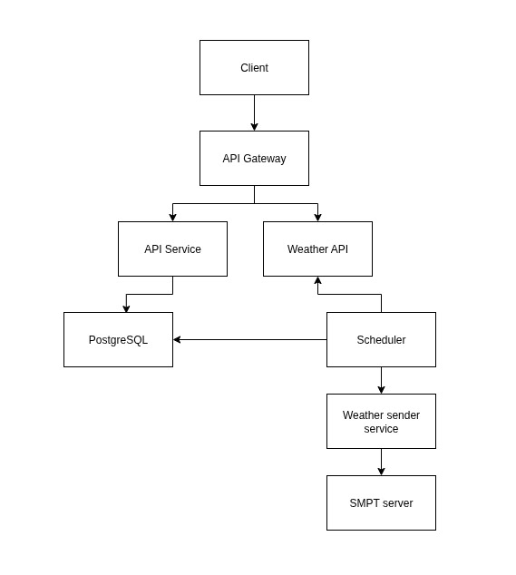

# ADR-002: Вибір протоколу для комунікації між мікросервісами

### Статус: Прийнято
### Дата: 2025-07-06
### Автор: Dmytro Podolynnyi

## Контекст

У процесі розбиття сервісу з моноліту на мікросервісну архітектури було вирішено винести функціонал відправки email (через SMTP) в окремий сервіс (`Weather sender service`). Необхідно обрати протокол взаємодії між `Scheduler` та `Weather sender service`.

Основні вимоги:
- Низька затримка
- Малий час на впровадження
- Можливість масштабування
- Мінімальна кількість залежностей від зовнішніх сервісів

## Розглянуті варіанти

### 1. gRPC

**Плюси:**
- Висока продуктивність завдяки HTTP/2 та ефективній двійковій серіалізації через Protocol Buffers
- Автодокуменування запитів для клієнтів/серверів
- Вбудована підтримка deadline, timeout, streaming, metadata
- Підходить для внутрішньої комунікації між сервісами в рамках одного data center

**Мінуси:**
- Складний процес дебагінгу (порівняно з HTTP)
- Не можливий для інтеграції з фронтендом
- Не всі проксі/гейтвеї підтримують HTTP/2 (який використовується в gRPC)

### 2. HTTP/REST

**Плюси:**
- Низький поріг входу для розробників
- Легко інтегрується з будь-якими клієнтами, браузерами, інструментами (Postman, curl)
- Легко логувати, моніторити, дебажити

**Мінуси:**
- Текстовий формат (JSON) сповільнює передачу великих обсягів даних
- Відсутність strict-схеми (можна частково компенсувати OpenAPI/Swagger)
- Не підтримує стримінг "з коробки", як у gRPC

### 3. Queue (Kafka, RabbitMQ тощо)

**Плюси:**
- Висока надійність: повідомлення не губляться навіть якщо сервіс тимчасово недоступний
- Асинхронна комунікація, добре масштабується
- Підходить для високонавантажених систем з великим потоком подій

**Мінуси:**
- Ускладнена архітектура (потрібна інфраструктура: брокер, продюсер, консьюмер)
- Затримки при обробці повідомлень
- Не підходить для запитів, які очікують миттєвий результат (RPC-подібні)

## Прийняте рішення

Обрано **gRPC** для синхронної взаємодії між `Scheduler` і `Weather sender service`.

## Схема високорівневої архітектури після розбиття моноліту на мікросервіси:

## Причини вибору:
- Потрібна швидка реакція на запит (email має надсилатися негайно після тригера)
- gRPC має низьку затримку і сувору типізацію
- Архітектура поки не вимагає асинхронної обробки черг
- Комунікація внутрішня — немає потреби підтримувати REST для зовнішніх клієнтів

## Наслідки

**Позитивні:**
- Мінімальна затримка між 'Scheduler' та email-сервісом
- Зрозумілий контракт завдяки protobuf
- Підготовка до подальшого розширення (можна легко додати ще методи без зміни архітектури)

**Негативні:**
- Складніший моніторинг у порівнянні з HTTP
- Необхідно підтримувати `.proto` схеми
- Сервіси повинні підтримувати HTTP/2
