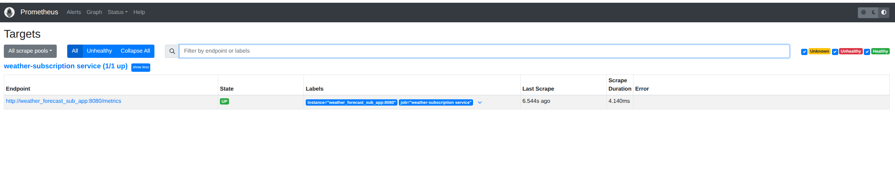
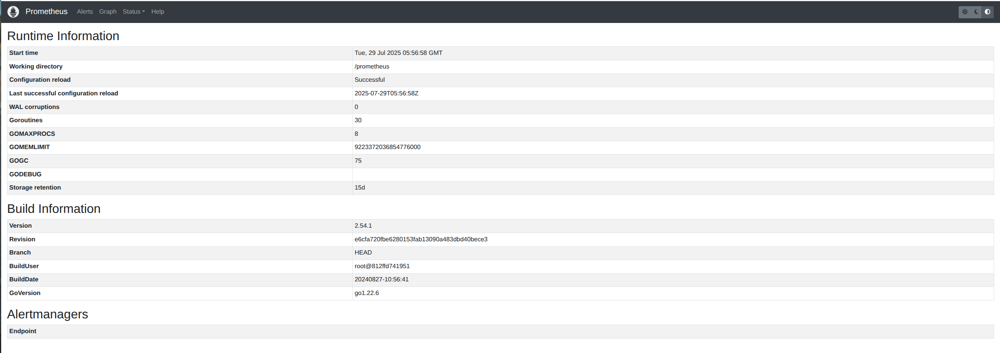
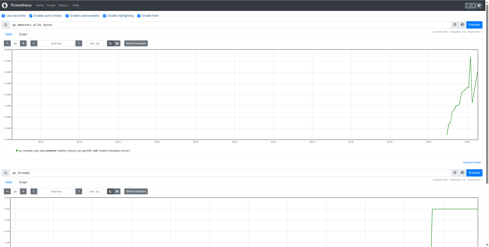
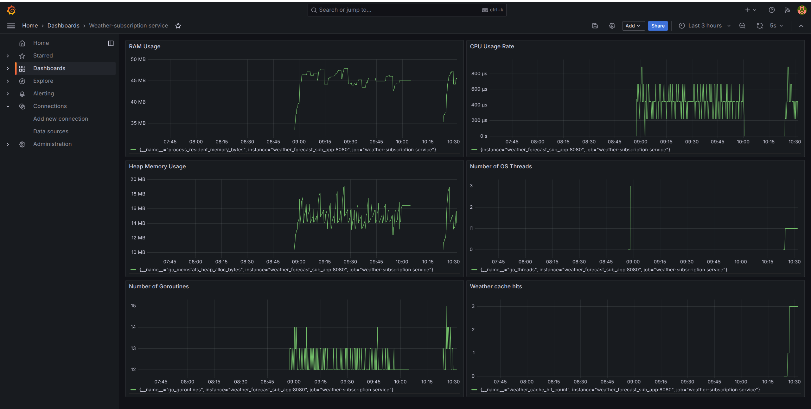

## Впровадження метрик

Для моніторингу стану та коректної роботи сервісу були впроваджені базові метрики за допомогою Prometheus. Моніторинг здійснюється за допомогою Grafana.

### Інтеграція з додатком

У HTTP-сервер мікросервісу ms-weather-subscription, реалізований з використанням Gin, було додано роутер для експорту метрик:
```
router.GET("/metrics", gin.WrapH(promhttp.Handler()))
```

Цей endpoint повертає стандартні метрики Go та HTTP за допомогою бібліотеки `promhttp`.

--- 

### Список цілей Prometheus



--- 

### Загальна інформація про запуск Prometheus



--- 

### Перегляд експорту метрик з /metrics



--- 

### Дашборд у Grafana


