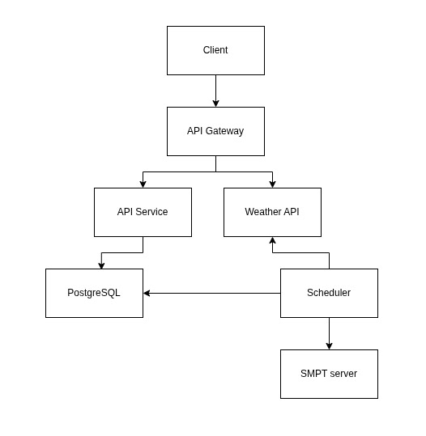
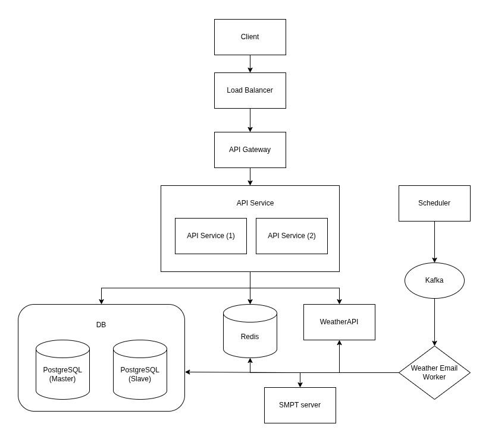

# System Design: Weather Subscription API

## 1. Міркування

## 1.1 Припущення
- Передбачається, що система буде надавати функціонал для керування підписками на оновлення погоди в двох варіантах:
  - як окремий сервіс з мнімальним власним веб-інтерфейсом, необхідним для створення підписки на розсилку оновлення погоди.
  - як публічне АРІ для керування підписками на розсилку оновлення погоди.
- Основною метою сервісу є отримання погодних даних за допомогою стороннього API і доставка цієї інформації за підпискою через email.
- Передбачається використання Golang (v1.24) як основної мови розробки серверної частини, PostgreSQL як сховища даних, Docker як середовища для локальної розробки, WeatherAPI (Free plan) як провайдер даних прогнозу погоди.
- З'єднання з WeatherAPI передбачається стабільним, але в разі збою або тимчасової недоступності мають бути передбачені кешування або механізми повторної спроби розсилки емейлів.

### 1.2 Обмеження
- **Бюджет**: $20 (лише для хостингу всіх необхідних компонентів системи)
- **Обмеження зовнішнього API**: 
  - 1М запитів/місяць
  - Час безвідмовної роботи: 95.5%
- **Відповідність**: система відповідає вимогам Загального регламенту про захист даних (GDPR)

### 1.3 Функціональні вимоги
- Користувачі мають змогу створити підписку на оновлення погоди для конкретного міста, вказавши свій email
- Попередньо потрібно підтрвердити підписку через посилання, яке надійде на вказаний email
- Система надсилає регулярні повідомлення на поштову скриньку (щодня, щогодини)
- API для керування підписками (створення і видалення підписки)
- Можливість отримання поточної інформації про погоду в обраному місті

### 1.4 Нефункціональні вимоги
- **Доступність**: 
  - 99.5% uptime для АРІ керування підписка;
  - 95.5% uptime для сервісу розсилки повідомлень і отримання данних про погоду;
- **Масштабованість**: до 80K користувачів, 800К повідомлень/день
- **Затримка**: < 300ms для API запитів
- **Надійність**: гарантована доставка поштових повідомлень
- **Безпека**: підтвердження створення підписки і валідація даних

### 1.5 Системне середовище
#### 1.5.1 Середовище розробки
- **Docker Compose** для запуску всіх сервісів системи (доступний на всіх ОС)

#### 1.5.2 Середовище розгортання
- **Хостинг**: AWS (надає безкоштовний план для EC2, RDS, SQS протягом 12 місяців)

---

## 2. Оцінка навантаження

### 2.1 Користувачі та трафік
- **Активні користувачі**: 50K
- **Підписки користувача**: 1–2
- **API запити**: 800 RPS (пік)
- **Повідомлення**: 90K/день

### 2.2 Дані
- **Підписка**: ~350 bytes
- **Логи**: ~1KB (на один запит)
- **Загальний обсяг**: ~33GB/рік

### 2.3 Bandwidth
- **Incoming**: 1 Mbps
- **Outgoing**: 3 Mbps (sending email)
- **External API**: 50 Mbps

---

## 3. High-Level архітектура

### 3.1. Першочергова архітектура



### 3.2. Масштабована архітектура

---

## 4. Детальний дизайн компонентів

### 4.1. Load Balancer (Nginx)
**Відповідальність**: 
- Розподіл навантаження між кількома екземплярами API сервісу
- Rate limiting для захисту від DDoS атак
- Health-check на `/ping`

### 4.2. API Gateway (Nginx)
**Відповідальність**:
- Маршрутизація запитів до API сервісу
- Rate limiting (1000 запитів/год, 5 запитів/сек на користувача)
- Обробка HTTPS

### 4.3. API Service (Go + Gin)
**Відповідальність**:
- Обробка HTTP-запитів (Gin framework)
- Робота з підписками (зберігання, підтвердження, видалення)
- Взаємодія з WeatherAPI та PostgreSQL

**Endpoints**:
- `GET    /ping                     `
- `GET    /api/weather/?city={city} `
- `POST   /api/subscribe            `
- `GET    /api/confirm/:token       `
- `GET    /api/unsubscribe/:token   `

### 4.4. Weather API (WeatherAPI integration)
**Відповідальність**:
- Запити до зовнішнього API (WeatherAPI)
- Перетворення даних у внутрішній формат

**Client settings**:
```go
const weatherAPIClientTimeout    = 10 * time.Second

type WeatherAPIClient struct {
	APIKey     string
	BaseURL    string
	HTTPClient *http.Client
}

func NewWeatherAPIClient(apiKey string) *WeatherAPIClient {
	return &WeatherAPIClient{
		APIKey:     apiKey,
		BaseURL:    "https://api.weatherapi.com/v1",
		HTTPClient: &http.Client{Timeout: weatherAPIClientTimeout},
	}
}
```

### 4.5. Scheduler (Cron jobs)
**Відповідальність**:
- Періодичні задачі по розкладу

**Задачі**:
```go
type CronRunner struct {
	services *service.Services
	cron     *cron.Cron
}

func (c *CronRunner) Start() {
	c.registerTasks()
	c.cron.Start()
}

func (c *CronRunner) registerTasks() {
	// Top of each hour (7:00, 8:00, 9:00, etc.)
	c.addTask("0 * * * *", c.hourlyWeatherEmailTask, "hourly weather email sending")
	// Daily at 7AM
	c.addTask("0 7 * * *", c.dailyWeatherEmailTask, "daily weather email sending")
}
```

### 4.6. PostgreSQL
**Відповідальність**:
- Зберігання даних про підписки на розсилку погоди

**Схема бази даних**:


**Оптимізація**:
- B-Tree індекси на полях `id`, `email`, `token`
- Використання `uuid_generate_v4()` для генерації унікальних ідентифікаторів
- PRIMARY KEY constraint на полі `id` для швидкого доступу до підписки
- UNIQUE constraint на полях `email` і `token`
- Використання `TIMESTAMPTZ` для зберігання дати з часовим поясом

### 4.7. Kafka
**Відповідальність**:

- Асинхронна обробка подій розсилки погоди
- Зберігання повідомлень для повторної доставки

**Топіки**:
- `weather-email` – події розсилки погоди (hourly/daily)

### 4.8. Weather Email Worker
**Відповідальність**:

- Трекінг подій з Kafka (`weather-email`)
- Отримання погоди з Redis (або з WeatherAPI при відсутності кешу)
- Відправлення листів через SMTP

### 4.9. SMTP Server
**Відповідальність**:

- Відправлення email повідомлень

**Налаштування**:
- ukr.net SMTP сервер
- TLS шифрування

### 4.10. Redis
**Відповідальність**:

- Кешування даних з WeatherAPI
- Зниження навантаження на зовнішній API
- Швидкий доступ до даних прогнозу погоди

---

## 5. Надійність & стійкість

### 5.1 Масштабування
**Горизонтальне**:
- PostgreSQL (Mater-Slave реплікація)
- API Service (Load Balancer + 2 інстанси сервісу)

**Вертикальне**:
- Вертикальне масштабування відсутнє

### 5.2 Відмовостійкість системи
- У разі недоступності сервісу WeatherAPI, всі розсилки емейлів призупиняються поки WeatherAPI не стане доступний (керування підписками в цей час доступне).
- У разі збоїв на стороні даного сервісу або на у сторонніх сервісів, які використовує дана система, не надіслані поштові повідомлення будуть зберігатися в черзі Kafka протягом 3-ох годин.
- Система не гарантує доставку повідомлень у разі збою на стороні SMTP провайдера.